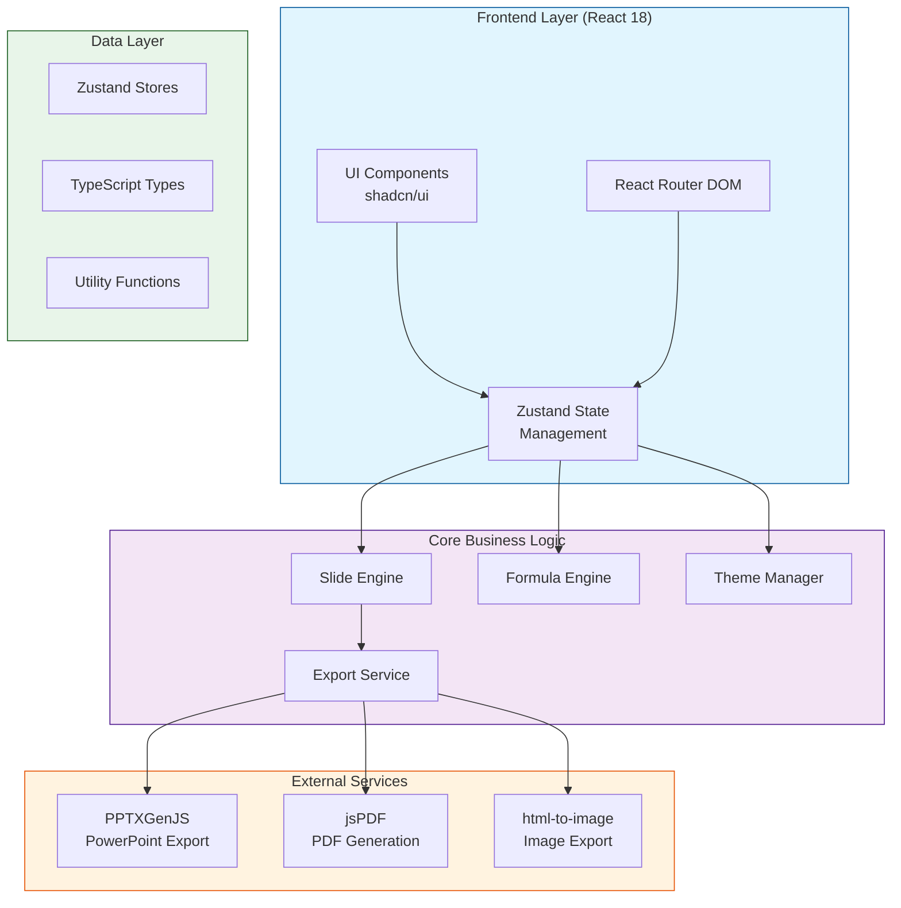
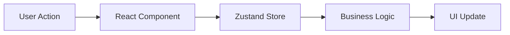
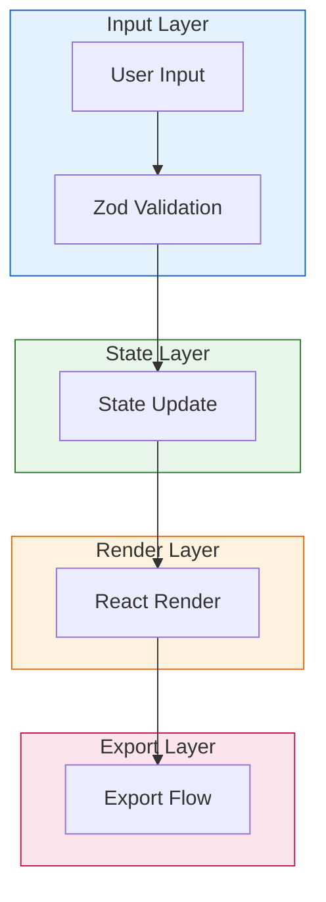
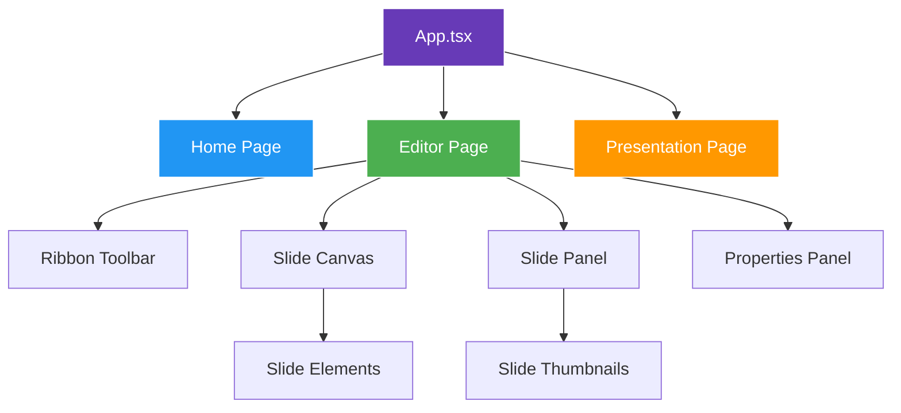

# Lade Slides Studio

> A powerful **web-based presentation and spreadsheet application** for creating, editing, and presenting professional slideshows with integrated spreadsheet functionality. Built with modern web technologies to deliver a seamless, feature-rich experience.

---

## ✨ Key Highlights

- **🎯 All-in-One Solution** — Create, edit, and present slides with built-in spreadsheet capabilities
- **⚡ Lightning Fast** — Powered by Vite for instant hot reloads and optimized builds
- **🎨 Fully Customizable** — Themes, transitions, animations, and styling options
- **📤 Multiple Export Formats** — Export to PPTX, PDF, and image formats
- **🔄 Real-time Collaboration** — Work together with your team seamlessly
- **📱 Responsive Design** — Works on desktop and tablet devices

---

## 📋 Table of Contents

- [Features](#features)
- [System Architecture](#system-architecture)
- [Tech Stack](#tech-stack)
- [Getting Started](#getting-started)
- [Configuration](#configuration)
- [Development Stats](#development-stats)
- [Contributing](#contributing)
- [License](#license)

---

## 🚀 Features

### Core Features

| Feature | Description |
|---------|-------------|
| **Slide Editor** | Create and edit presentation slides with a rich visual interface |
| **Spreadsheet Integration** | Built-in formula engine for spreadsheet calculations with 50+ functions |
| **Real-time Collaboration** | Work together with your team seamlessly in real-time |
| **Theme Editor** | Customize slide themes with customizable colors, backgrounds, and fonts |
| **Transitions & Animations** | Add smooth transitions and animations to slides |
| **Export Options** | Export presentations in multiple formats (PPTX, PDF, images) |
| **Master Slides** | Create reusable slide templates for consistent branding |
| **Multi-layout Support** | Choose from various slide layouts (title, content, two-column, etc.) |

### UI Components

- **Ribbon Toolbar** — Microsoft Office-style ribbon interface with contextual tabs
- **Slide Panel** — Thumbnail navigation for slides with drag-and-drop reordering
- **Properties Panel** — Fine-tune element properties with live preview
- **Smart Guides** — Alignment assistance while editing for precision
- **Presenter View** — Speaker notes and presentation controls
- **Drawing Tools** — Freehand drawing and shape tools for annotations
- **Commenting** — Add and manage comments on slides for collaboration
- **Search & Filter** — Quickly find slides and content within presentations

### Advanced Features

- **Undo/Redo** — Full history support with unlimited undo/redo steps
- **Keyboard Shortcuts** — Efficient keyboard shortcuts for power users
- **Slide Duplication** — Clone existing slides with one click
- **Image Handling** — Upload, crop, and manipulate images within slides
- **Chart Integration** — Create and embed charts using Recharts
- **Table Support** — Built-in tables with cell merging and styling
- **Auto-save** — Automatic saving of work to prevent data loss

---

## 🏗️ System Architecture

### High-Level Architecture Flow



### User Interaction Flow



### Data Flow Architecture



### Component Hierarchy



---

## 💻 Tech Stack

### Frontend Core

| Technology | Version | Purpose |
|------------|---------|---------|
| **React** | 18.3.1 | UI Library |
| **TypeScript** | 5.8.3 | Type Safety |
| **Vite** | 5.4.19 | Build Tool & Dev Server |
| **Tailwind CSS** | 3.4.17 | Utility-first CSS |
| **shadcn/ui** | Latest | Accessible Components |
| **Zustand** | 5.0.11 | State Management |
| **React Router** | 6.30.1 | Client-side Routing |
| **Lucide React** | 0.462.0 | Icon Library |

### Libraries & Tools

| Library | Version | Purpose |
|---------|---------|---------|
| **PPTXGenJS** | 4.0.1 | PowerPoint (.pptx) export |
| **jsPDF** | 4.2.0 | PDF generation |
| **html-to-image** | 1.11.13 | HTML to image conversion |
| **Recharts** | 2.15.4 | Charts & data visualization |
| **date-fns** | 3.6.0 | Date manipulation |
| **Zod** | 3.25.76 | Schema validation |
| **React Hook Form** | 7.61.1 | Form handling |
| **@tanstack/react-query** | 5.83.0 | Data fetching |
| **uuid** | 13.0.0 | Unique ID generation |
| **JSZip** | 3.10.1 | ZIP file handling |

### Development Tools

| Tool | Version | Purpose |
|------|---------|---------|
| **Vitest** | 3.2.4 | Testing Framework |
| **ESLint** | 9.32.0 | Code Linting |
| **PostCSS** | 8.5.6 | CSS Processing |
| **Sharp** | 0.34.5 | Image Processing |
| **Tailwind Animate** | 1.0.7 | CSS Animations |

### Development Dependencies

| Package | Version |
|---------|---------|
| **@eslint/js** | 9.32.0 |
| **@tailwindcss/typography** | 0.5.16 |
| **@testing-library/jest-dom** | 6.6.0 |
| **@testing-library/react** | 16.0.0 |
| **@types/node** | 22.16.5 |
| **@types/react** | 18.3.23 |
| **@types/react-dom** | 18.3.7 |
| **@vitejs/plugin-react-swc** | 3.11.0 |
| **autoprefixer** | 10.4.21 |
| **eslint** | 9.32.0 |
| **eslint-plugin-react-hooks** | 5.2.0 |
| **eslint-plugin-react-refresh** | 0.4.20 |
| **globals** | 15.15.0 |
| **jsdom** | 20.0.3 |
| **typescript** | 5.8.3 |
| **typescript-eslint** | 8.38.0 |

---

## 🛠️ Getting Started

### Prerequisites

> **⚠️ Important**: Ensure you have the following installed before proceeding:

- **Node.js** — Version 18.0.0 or higher — [Download here](https://nodejs.org/)
- **npm** — Comes bundled with Node.js (or use yarn/pnpm)
- **Git** — For version control — [Download here](https://git-scm.com/)

### Installation Steps

```bash
# Step 1: Clone the repository
git clone https://github.com/girishlade111/lade-slides-studio.git

# Step 2: Navigate to the project directory
cd lade-slides-studio

# Step 3: Install dependencies
npm install

# Step 4: Start development server
npm run dev
```

### Build & Deploy Commands

```bash
# Build for production (optimized)
npm run build

# Build in development mode (faster, unoptimized)
npm run build:dev

# Preview production build locally
npm run preview

# Run tests
npm run test

# Run tests in watch mode (auto-reload)
npm run test:watch

# Run linting
npm run lint
```

### Development Workflow

1. **Start Development** — Run `npm run dev` to start the dev server
2. **Make Changes** — Edit code in the `src/` directory
3. **Check Linting** — Run `npm run lint` before committing
4. **Run Tests** — Ensure all tests pass with `npm run test`
5. **Build** — Create production build with `npm run build`

---

## ⚙️ Configuration

### Project Structure

```
lade-slides-studio/
├── public/                      # Static assets
│   ├── favicon.ico              # Browser favicon
│   └── lade-logo.png            # Application logo
├── src/
│   ├── assets/                  # Project assets & images
│   ├── components/              # React components
│   │   ├── slides/              # Slide-related components
│   │   │   ├── SlideCanvas.tsx  # Main slide rendering
│   │   │   ├── SlideEditor.tsx    # Slide editing interface
│   │   │   ├── SlidePanel.tsx    # Slide thumbnails
│   │   │   ├── Ribbon.tsx       # Toolbar ribbon
│   │   │   └── properties/     # Property panels
│   │   └── ui/                 # UI components (shadcn)
│   │       ├── button.tsx
│   │       ├── dialog.tsx
│   │       ├── dropdown-menu.tsx
│   │       └── ... (30+ components)
│   ├── hooks/                   # Custom React hooks
│   │   ├── useSlides.ts        # Slide management
│   │   └── useHistory.ts       # Undo/redo logic
│   ├── lib/                    # Utility functions
│   │   ├── formulaEngine.ts   # Spreadsheet formulas (50+ functions)
│   │   ├── exportUtils.ts    # Export utilities
│   │   └── utils.ts           # General utilities
│   ├── pages/                  # Page components
│   │   ├── Home.tsx            # Landing page
│   │   ├── Editor.tsx          # Main editor
│   │   └── Presentation.tsx    # Presentation view
│   ├── stores/                 # Zustand state stores
│   │   ├── useSlideStore.ts   # Slide state management
│   │   ├── useThemeStore.ts  # Theme state
│   │   └── useUIStore.ts     # UI state
│   ├── types/                  # TypeScript definitions
│   │   ├── slide.ts           # Slide types
│   │   ├── element.ts        # Element types
│   │   └── index.ts          # Main type exports
│   ├── App.tsx                 # Root application component
│   ├── main.tsx               # Application entry point
│   └── index.css              # Global styles
├── scripts/                     # Build scripts
│   └── generate-favicon.mjs   # Favicon generation script
├── index.html                   # Entry HTML file
├── package.json               # Dependencies & scripts
├── tsconfig.json              # TypeScript configuration
├── vite.config.ts             # Vite configuration
├── tailwind.config.js        # Tailwind CSS configuration
├── postcss.config.js          # PostCSS configuration
├── .eslintrc.cjs             # ESLint configuration
└── .env                     # Environment variables
```

### Environment Variables

Create a `.env` file in the root directory:

```env
# Application Configuration
VITE_APP_TITLE=Lade Slides Studio

# API Configuration (if using backend)
VITE_API_URL=http://localhost:3000/api

# Feature Flags
VITE_ENABLE_ANALYTICS=false
VITE_DEBUG_MODE=false
```

### Package Scripts Reference

| Script | Command | Description |
|--------|---------|-------------|
| `dev` | `vite` | Start development server with HMR |
| `build` | `vite build` | Build for production |
| `build:dev` | `vite build --mode development` | Build in development mode |
| `lint` | `eslint .` | Run ESLint code analysis |
| `preview` | `vite preview` | Preview production build locally |
| `test` | `vitest run` | Run tests once |
| `test:watch` | `vitest` | Run tests in watch mode |

### TypeScript Configuration

```json
{
  "compilerOptions": {
    "target": "ES2020",
    "useDefineForClassFields": true,
    "lib": ["ES2020", "DOM", "DOM.Iterable"],
    "module": "ESNext",
    "skipLibCheck": true,
    "moduleResolution": "bundler",
    "allowImportingTsExtensions": true,
    "resolveJsonModule": true,
    "isolatedModules": true,
    "noEmit": true,
    "jsx": "react-jsx",
    "strict": true,
    "noUnusedLocals": true,
    "noUnusedParameters": true,
    "noFallthroughCasesInSwitch": true
  }
}
```

### Tailwind CSS Configuration

- **Version**: 3.4.17
- **Plugins**: @tailwindcss/typography
- **Features**: CSS animations via tailwindcss-animate

### Vite Configuration

- **Version**: 5.4.19
- **Plugin**: @vitejs/plugin-react-swc
- **Features**: Hot Module Replacement (HMR), Code Splitting, Optimized Builds

---

## 📊 Development Stats

### Project Information

| Property | Value |
|----------|-------|
| **License** | Private |
| **Version** | 0.0.0 |
| **Type** | React + TypeScript Web Application |
| **Runtime Dependencies** | 59 packages |
| **Dev Dependencies** | 24 packages |
| **Total Dependencies** | 83 packages |

### Dependency Categories

- **UI Components**: 30+ shadcn/ui components
- **State Management**: Zustand for global state
- **Form Handling**: React Hook Form + Zod validation
- **Export Libraries**: PPTXGenJS, jsPDF, html-to-image
- **Date Handling**: date-fns
- **Icons**: Lucide React (500+ icons)
- **Testing**: Vitest + Testing Library
- **Drag & Drop**: @dnd-kit/core, @dnd-kit/sortable
- **Charts**: Recharts
- **File Handling**: file-saver, jszip

### Browser Support

| Browser | Minimum Version |
|---------|-----------------|
| Chrome | 90+ |
| Firefox | 88+ |
| Safari | 14+ |
| Edge | 90+ |

### Node.js Requirements

- **Minimum Version**: 18.0.0
- **Recommended Version**: 20.0.0 or higher

---

## 🤝 Contributing

We welcome contributions! Please follow these steps:

```bash
# 1. Fork the repository
# 2. Clone your fork
git clone https://github.com/YOUR_USERNAME/lade-slides-studio.git

# 3. Create a feature branch
git checkout -b feature/your-feature-name

# 4. Make your changes and commit
git add .
git commit -m 'Add: your feature description'

# 5. Push to your fork
git push origin feature/your-feature-name

# 6. Open a Pull Request
```

### Contribution Guidelines

- Follow the existing code style and conventions
- Run `npm run lint` before submitting changes
- Ensure all tests pass with `npm run test`
- Update documentation for any new features
- Use descriptive commit messages
- Create tests for new features

---

## 📄 License

**Private** — All rights reserved

---

## 👤 Author

**Girish Lade**

- GitHub: [@girishlade111](https://github.com/girishlade111)
- Email: girishlade111@gmail.com

---

<p align="center">
  <strong>⭐ Star this repository if you find it helpful!</strong>
</p>